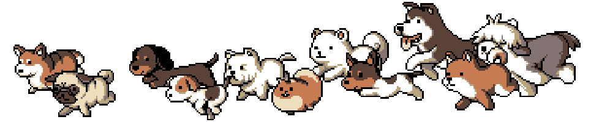

## hi there! 🎈

i'm Shu, an AI generalist passionate about open source and exploring the intersection of technology and design.

### 🏓 current focus

i'm currently working on **[ProteinGym](https://github.com/ProteinGym)** - an open source benchmarking platform for evaluating machine learning models for proteins. this project is a combination of computational biology and machine learning applications in protein engineering, with [proteingym-base](https://github.com/ProteinGym/proteingym-base) to process data and models and [proteingym-benchmark](https://github.com/ProteinGym/proteingym-benchmark) to benchmark selected data and models.

### 😻 open source stuff

here are some projects i've worked on in the past:

#### [colours](https://colors.shushi.me/)
- an interactive colour sotry that I constantly go back to in order to sharpen my eyes and refresh my words about colors.
- **tech stack**: SvelteKit, TypeScript, Tailwind CSS.

#### [nederland kringloopwinkels](https://tintinrevient.github.io/utrecht-thriftstore/)
- an interactive data visualization project listing kringloopwinkels in the netherlands.
- **tech stack**: SvelteKit, TypeScript, Tailwind CSS, MapLibre GL JS, deck.gl.

#### [mycorrhizal network](https://github.com/tintinrevient/mycorrhizal-network)
- a distributed network traffic analysis system that captures, traces, and [visualizes network topology](https://tintinrevient.github.io/mycorrhizal-network/) patterns using graph-based visualization, inspired by "the last of us". 
- **tech stack**: Apache Kafka, ksqlDB, Kubernetes, Helm, Neo4j, Scapy, Neovis.

#### [NOT doing excel](https://github.com/tintinrevient/not-doing-excel)
- a data pipeline project demonstrating how to migrate from Excel-based workflows to a structured database system with interactive querying and visualization capabilities. 
- **tech stack**: PostgreSQL, Apache Superset.

#### [joints data](https://github.com/tintinrevient/joints-data)
- a computer vision research project analyzing human poses and body contours in classical and modern artwork using pose estimation and body segmentation techniques. 
- **tech stack**: OpenPose, DensePose, COCO Dataset, AdaIN Style Transfer.

